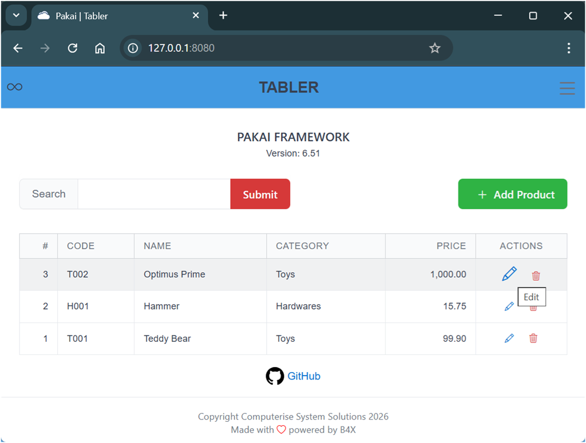

# Pakai Tabler - Web Application framework

Version: 6.51

Create Web API or Application Backend Server using B4J project template

### Preview


---

## Templates
- Pakai Tabler (6.51).b4xtemplate

## Depends on
- [EndsMeet.b4xlib](https://github.com/pyhoon/EndsMeet)
- [MiniCSS.b4xlib](https://github.com/pyhoon/MiniCSS-B4X)
- [MiniHtml.b4xlib](https://github.com/pyhoon/MiniHtml2-B4X)
- [MiniJS.b4xlib](https://github.com/pyhoon/MiniJS-B4X)
- [MiniORMUtils.b4xlib](https://github.com/pyhoon/MiniORMUtils-B4X)
- [WebApiUtils.b4xlib](https://github.com/pyhoon/WebApiUtils-B4J)
- sqlite-jdbc-3.7.2.jar (SQLite)
- mysql-connector-j-9.3.0.jar (MySQL)
- mariadb-java-client-3.5.6.jar (MariaDB)

## Features
- Frontend using Tabler v1.4.0, Bootstrap Icons v1.13.1, HTMX v2.0.8, AlpineJS v3.15.8
- Responsive design with modal dialog and toast
- SQLite and MySQL/MariaDB backend
- Built-in REST API or CRUD examples

## Improvement
- Better UI/UX/DX compared to version 5.x
- More flexible to generate new models
- HTML generated using B4X
- No JavaScript module
- No jQuery AJAX parsing
- JSON/XML API supported
- WebApiUtils supported with HelpHandler

### Code Example
```b4x
Private Sub CreateProductsTable As MiniHtml
    If App.ctx.ContainsKey("/products/table") = False Then
        Dim table1 As MiniHtml = Table.cls("table table-bordered table-hover rounded small")
        Dim thead1 As MiniHtml = Thead.cls("table-light").up(table1)
        Th.up(thead1).sty("text-align: right; width: 50px").text("#")
        Th.up(thead1).text("Code")
        Th.up(thead1).text("Name")
        Th.up(thead1).text("Category")
        Th.up(thead1).sty("text-align: right").text("Price")
        Th.up(thead1).sty("text-align: center; width: 120px").text("Actions")
        Tbody.up(table1)
        App.ctx.Put("/products/table", table1)
    End If

    DB.Open
    DB.Table = "tbl_products p"
    DB.Columns = Array("p.id id", "p.category_id catid", "c.category_name category", "p.product_code code", "p.product_name name", "p.product_price price")
    DB.Join = Array("tbl_categories c", "p.category_id = c.id")
    DB.OrderBy = CreateMap("p.id": "DESC")
    DB.Query
    Dim rows As List = DB.Results
    DB.Close

    Dim table1 As MiniHtml = App.ctx.Get("/products/table")
    Dim tbody1 As MiniHtml = table1.Child(1)
    tbody1.Children.Clear ' remove all children
    For Each row As Map In rows
        row.Put("price", NumberFormat2(row.Get("price"), 1, 2, 2, True))
        Dim tr1 As MiniHtml = CreateProductsRow
        tr1.Child(0).text2(row.Get("id"))
        tr1.Child(1).text2(row.Get("code"))
        tr1.Child(2).text2(row.Get("name"))
        tr1.Child(3).text2(row.Get("category"))
        tr1.Child(4).text2(row.Get("price"))
        tr1.Child(5).Child(0).attr("hx-get", "/hx/products/edit/" & row.Get("id"))
        tr1.Child(5).Child(1).attr("hx-get", "/hx/products/delete/" & row.Get("id"))
        tr1.up(tbody1)
    Next
    Return table1
End Sub
```

**Support this project**

<a href="https://paypal.me/aeric80/"></a>
